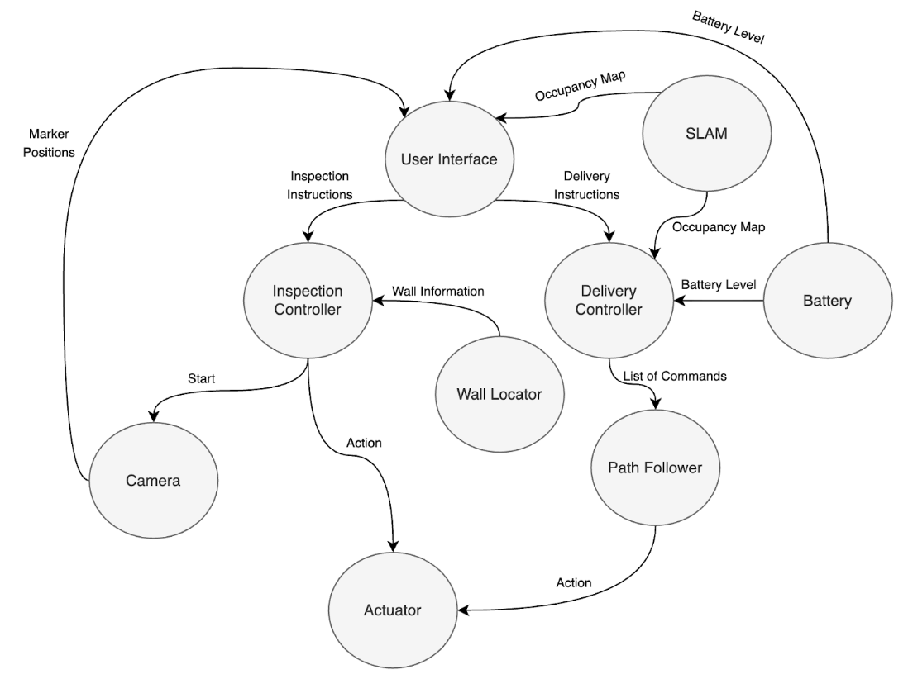

# MTRX3760: Project Two - Lightly Roasted LiPo's

## Actuator Node
Breaks motion instructions into absolute (set position to) or velocity (set velocity to) commands. Then uses a coordinator to route instructions and feedback to the relevant controller for the command.
Proportional control was suitable for the absolute angular controller, while Proportional and Dervivative control gave the best results for the absolute linear controller.
